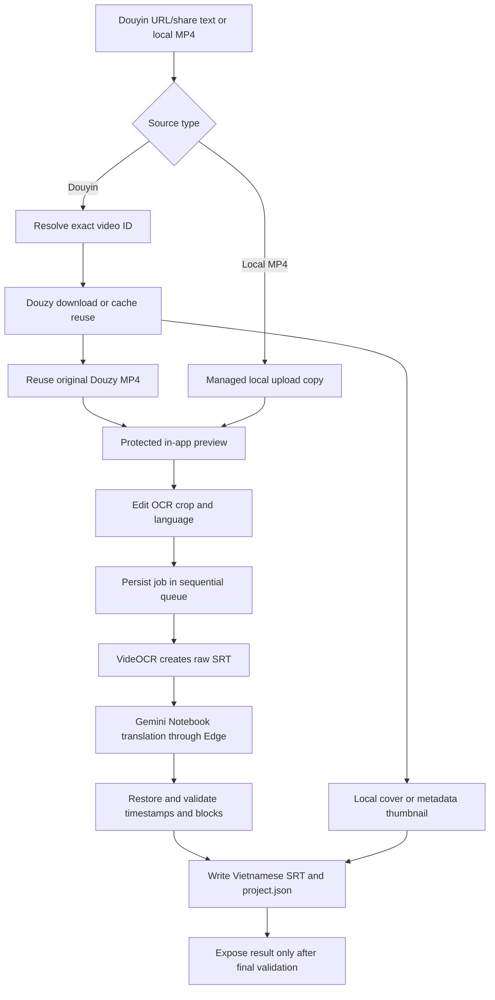
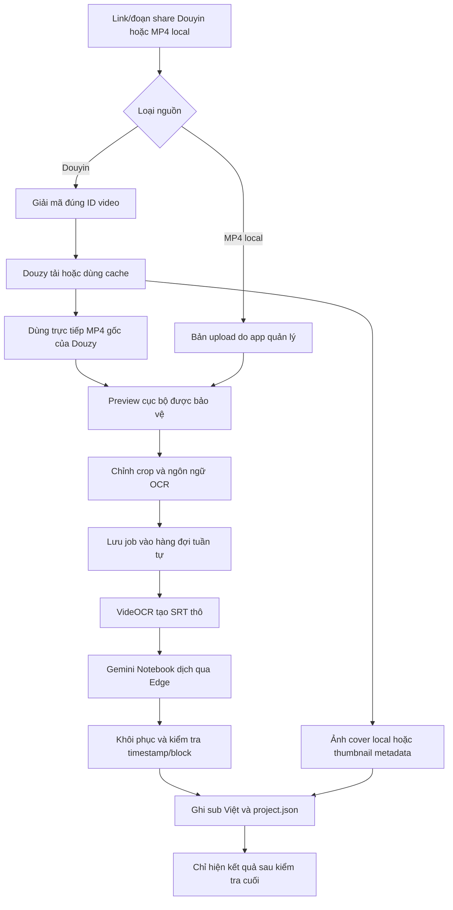

<p align="center">
  
</p>

<h1 align="center">VietSub Studio</h1>

<p align="center">
  An open-source Windows desktop workflow that turns Douyin videos or local MP4 files into timestamp-safe Vietnamese subtitle projects: preview the exact OCR region, queue multiple videos, extract text with VideOCR, translate through your own Gemini Notebook session, validate the SRT, and keep every intermediate result recoverable.<br>
  Công cụ desktop Windows mã nguồn mở biến video Douyin hoặc MP4 trên máy thành dự án phụ đề Việt giữ nguyên timestamp: xem/chỉnh chính xác vùng OCR, xếp nhiều video vào hàng đợi, nhận chữ bằng VideOCR, dịch qua Gemini Notebook của chính bạn, kiểm tra SRT và giữ lại file trung gian để có thể chạy tiếp khi gặp lỗi.
</p>

<p align="center">
  <a href="https://github.com/qvinh8726/VietSub-Studio/releases/latest">Download / Tải bản mới nhất</a>
  · <a href="#english">English</a>
  · <a href="#tiếng-việt">Tiếng Việt</a>
  · <a href="CONTRIBUTING.md">Contributing / Đóng góp</a>
</p>

<p align="center">
  
  
  
  
</p>

> [!IMPORTANT]
> The portable EXE contains VietSub Studio, but it does **not** bundle Douzy, VideOCR, Microsoft Edge, a Google account, or a Gemini Notebook. Those are external prerequisites on every computer.
>
> File EXE portable chứa VietSub Studio nhưng **không** đóng gói Douzy, VideOCR, Microsoft Edge, tài khoản Google hoặc Gemini Notebook. Mỗi máy vẫn phải chuẩn bị các thành phần đó.
>
> Douyin videos are processed directly from the MP4 downloaded by Douzy, so VietSub Studio does not create another full-size video copy. Local MP4 files keep a managed-copy workflow because browser uploads do not expose the original filesystem path safely.
>
> Video Douyin được xử lý trực tiếp từ file MP4 do Douzy tải, vì vậy VietSub Studio không nhân đôi thêm một video dung lượng lớn. MP4 chọn từ máy vẫn dùng bản sao do app quản lý vì trình duyệt không cung cấp đường dẫn file gốc một cách an toàn.

---

# English

## Table of contents

- [What is VietSub Studio?](#what-is-vietsub-studio)
- [Why this project exists](#why-this-project-exists)
- [Features](#features)
- [What the output looks like](#what-the-output-looks-like)
- [Requirements](#requirements)
- [Quick start with the portable EXE](#quick-start-with-the-portable-exe)
- [First-run setup](#first-run-setup)
- [Processing videos](#processing-videos)
- [Running from source](#running-from-source)
- [Command-line usage](#command-line-usage)
- [Building the Windows app](#building-the-windows-app)
- [How it works](#how-it-works)
- [Configuration and local data](#configuration-and-local-data)
- [Privacy and security](#privacy-and-security)
- [Known limitations](#known-limitations)
- [Troubleshooting](#troubleshooting)
- [Frequently asked questions](#frequently-asked-questions)
- [Contributing](#contributing)

## What is VietSub Studio?

VietSub Studio is a Windows desktop orchestration tool for creators who need to turn burned-in subtitles inside long videos into editable Vietnamese SRT files. It is not a replacement for Douzy, VideOCR, Edge, Gemini, or a full video editor. Instead, it connects those existing tools into one repeatable workflow with preview, queueing, retry, validation, local project files, and update management.

The complete workflow is:

1. Accept a direct Douyin URL/share message or an MP4 selected from the user's machine.
2. Resolve short Douyin share links, reject mix/profile/playlist URLs, and identify the exact source video.
3. For Douyin, ask the installed Douzy sidecar to download the video or reuse an existing cache record. For a local MP4, store a managed upload copy and skip Douzy completely.
4. Stream the prepared video into the in-app preview and let the user drag or resize the OCR rectangle over the exact subtitle region.
5. Save the crop, OCR language, project name, source metadata, and video resolution as an independent queue job.
6. Run jobs sequentially so Douzy, VideOCR, Gemini, and the Edge debug profile are never driven concurrently by multiple videos.
7. Process Douyin videos directly from the original Douzy MP4 instead of cloning another multi-gigabyte video into the result folder.
8. Ask the installed VideOCR CLI to scan only the selected area and write the original-language `.raw.srt` file.
9. Connect Playwright to a dedicated Microsoft Edge debug profile, submit the raw SRT to the user's Gemini Notebook, and collect the translated response.
10. Restore source timecodes when Gemini rewrites compatible subtitle blocks, then reject incomplete translations, missing blocks, changed indexes, or invalid timestamps.
11. Write the Vietnamese `.vi.srt`, optional Douyin thumbnail, and `project.json` manifest. A job is marked successful only when the video reference and both subtitle files pass validation.

The application runs as a Flask service bound only to `127.0.0.1` and is presented as a native desktop window through pywebview/WebView2. Queue data, settings, downloaded media, OCR output, and browser sessions stay on the user's computer. Only the subtitle text intentionally submitted to Gemini leaves the local machine.

## Why this project exists

The project is designed around the parts of long-form subtitle work that become slow, repetitive, or unstable when performed manually:

- A two-hour video can make editing software sluggish long before subtitle translation is complete.
- Burned-in subtitles require a carefully selected OCR region; scanning the entire frame wastes time and increases recognition noise.
- Downloading or copying the same large source video more than once consumes unnecessary disk space. A 6 GB Douyin video should remain one 6 GB file, not become 12 GB before OCR even begins.
- Running multiple OCR or browser-automation jobs in parallel creates resource contention and makes failures harder to diagnose. VietSub Studio accepts multiple jobs but deliberately processes them one at a time.
- Gemini can return partial SRT, alter timestamps, or require a renewed Google session. The app validates the final structure and exposes a visible Edge fallback instead of silently reporting success.
- A failed translation should not force another download or OCR pass. Queue persistence and stage-aware retry reuse the prepared video and raw SRT whenever they are still valid.
- Open-source users need a clear installation and update path. The portable build includes an update banner, verified ZIP installation, automatic restart, and a manual GitHub fallback.

## Features

### Video input and source handling

- Accepts direct Douyin video URLs, `v.douyin.com` short links, and complete pasted share messages.
- Extracts URLs automatically and validates the real hostname to reject lookalike or malicious domains.
- Rejects mix, user-profile, and playlist-style sources because every queue item must represent one exact video.
- Accepts MP4 files from the local machine without requiring Douzy.
- Reuses the Douzy history/cache when the requested Douyin video is already available.
- Reads Douzy's recorded title, video path, metadata, and optional cover image.
- Processes the original Douzy MP4 directly, eliminating the previous second full-size project copy.
- Copies a local MP4 into managed app storage so it remains available to the persisted queue.

### OCR preview and recognition

- Streams a protected local video preview inside the app before starting OCR.
- Provides a visible, draggable, and resizable crop rectangle for the burned-in subtitle area.
- Stores crop coordinates per queue item and can reuse a saved default crop.
- Supports Chinese, English, Japanese, Korean, and Vietnamese OCR modes.
- Uses FFprobe when available to convert preview coordinates accurately to the source resolution.
- Calls the locally installed VideOCR CLI and writes raw OCR output to a dedicated `.raw.srt` file.

### Sequential queue and recovery

- Lets users prepare multiple Douyin and local MP4 jobs before processing starts.
- Uses one sequential worker: only one video controls Douzy, VideOCR, and Gemini at a time.
- Persists queued, running, successful, failed, and cancelled job metadata across app restarts.
- Supports removing waiting jobs, cancelling the active job, and clearing finished jobs.
- Retries from the earliest reusable stage: video preparation, OCR, or translation.
- Keeps incomplete project folders accessible without presenting them as successful results.
- Restores progress and incremental logs after a UI reload.

### Gemini Notebook and Edge automation

- Uses the user's own Gemini Notebook URL and Google session; no API key is stored by the project.
- Connects through Playwright to a dedicated Edge profile exposed only on `127.0.0.1:9222`.
- Starts Edge minimized by default while disabling background throttling that could stall automation.
- Waits for the actual Notebook chat interface before deciding that login is required.
- Shows Edge only when Google authentication expires or the Notebook needs manual inspection.
- Provides an explicit **Open Edge login** action for failed jobs.
- Cancels active Gemini generation when the workflow is stopped.

### Subtitle integrity and result management

- Preserves all source timestamps and subtitle block indexes.
- Restores original timecodes when Gemini preserves block structure but rewrites compatible timestamps.
- Rejects empty output, partial SRT, changed block counts, changed indexes, and missing translated files.
- Reports success only after the source video reference, raw SRT, and validated Vietnamese SRT all exist.
- Uses safe Windows project names, including reserved-name handling and length limits.
- Adds duplicate suffixes such as `(2)` and `(3)` without overwriting an existing project.
- Writes configuration, queue state, SRT output, and manifests atomically to reduce partially written files.
- Exports a Douyin thumbnail as JPG, PNG, or WebP when a local cover or valid saved metadata URL is available.
- Records source URL, video ID, source path, output paths, status, error, and update time in `project.json`.

### Desktop experience and diagnostics

- Provides a responsive pywebview desktop interface backed by a local Flask API.
- Includes a dependency health panel for Douzy, VideOCR, FFprobe, Notebook settings, and Edge.
- Shows recent Douzy history and can reload a previous video quickly.
- Supports a configurable output directory.
- Creates or recreates a Desktop shortcut for the packaged EXE.
- Keeps the Edge window minimized during normal translation while retaining a reliable visible fallback.
- Ships as a portable one-file Windows EXE with a custom icon.

### Updates, openness, and safety

- Checks official GitHub Releases for newer versions and displays an in-app update banner.
- Downloads the official portable ZIP, validates the expected repository URL, ZIP SHA256 file, GitHub asset digest, declared size, and embedded EXE.
- Replaces the running packaged EXE and restarts automatically when in-place updating is supported.
- Falls back to the official GitHub Release page when automatic installation is unavailable.
- Keeps machine-specific settings, queue files, local videos, browser profiles, and credentials out of the repository.
- Uses the MIT License so the workflow can be inspected, modified, redistributed, and extended subject to third-party terms.

## What the output looks like

If the project name is `Product Review`, VietSub Studio creates:

```text
Product Review/
├── Product Review.mp4 (local MP4 sources only)
├── Product Review.thumbnail.jpg (when available)
├── Product Review.raw.srt
├── Product Review.vi.srt
└── project.json
```

- Douyin videos are processed directly from the file downloaded by Douzy, avoiding a second full-size MP4 copy. The `video` field in `project.json` points to that original Douzy path. Local MP4 uploads are still copied into the project folder.
- `Product Review.thumbnail.jpg`: the Douyin thumbnail copied from Douzy or downloaded from its saved metadata when available; PNG and WebP are also supported.
- `Product Review.raw.srt`: OCR output in the selected source language.
- `Product Review.vi.srt`: translated Vietnamese subtitle with source timestamps preserved.
- `project.json`: project name, source URL, Douyin video ID, paths, status, error information, and update timestamp.

When a project folder already exists, the next project becomes `Product Review (2)`. Generated subtitles, thumbnails, and manifests use the unique project name; the referenced Douzy source MP4 keeps its original Douzy filename and location.

## Requirements

| Component | Required | Expected location or behavior | Why it is needed |
|---|---:|---|---|
| Windows 10/11 x64 | Yes | Desktop Windows session | The current integrations and packaged build are Windows-specific. |
| Microsoft Edge | Yes | Normal Edge installation | Gemini automation uses Edge's Chromium debugging interface. |
| Douzy | Douyin only | `%LOCALAPPDATA%\Programs\Douzy` | Downloads Douyin videos and maintains the local history/database. |
| Douzy configuration | Douyin only | `%APPDATA%\douyin-downloader-desktop\config.yml` | Provides the Douyin download directory and sidecar configuration. |
| VideOCR | Yes | `C:\Program Files\VideOCR\videocr-cli.exe` | Extracts subtitles from the video. |
| Gemini Notebook | Yes | `https://gemini.google.com/notebook/<id>` | Translates the SRT text into Vietnamese. |
| Google login | Yes | Dedicated Edge debug profile | Grants access to the selected Gemini Notebook. |
| FFmpeg / FFprobe | No | `ffprobe` available in `PATH` | Improves conversion of saved crop coordinates to the real video resolution. |
| Python 3.11+ | Source only | `python` available in `PATH` | Required only when running or building from source. |

Douzy and VideOCR are third-party applications and are not redistributed by this repository. Install them from sources you trust and follow their own licenses and documentation.

## Quick start with the portable EXE

1. Open [GitHub Releases](https://github.com/qvinh8726/VietSub-Studio/releases/latest).
2. Download `VietSub-Studio-Portable-*.zip`.
3. Extract the ZIP into a normal writable folder. Do not run the EXE from inside the ZIP preview.
4. Open `VietSub Studio.exe`.
5. The packaged app creates a `VietSub Studio` shortcut on the Desktop after the first successful launch. Use **Settings → Recreate Desktop shortcut** if it is deleted or the portable folder is moved.
6. The first launch may take 20-60 seconds while the one-file package is extracted and scanned by Windows security software.
7. If SmartScreen appears because the community build is not code-signed, review the publisher/source and choose **More info → Run anyway** only if you trust the downloaded release.
8. Open **Settings** and complete every required item shown in red.

You can verify the downloaded EXE with the `SHA256.txt` file included in the ZIP. The release page also publishes the ZIP checksum.

## First-run setup

### 1. Prepare Douzy

- Install Douzy in its default location.
- Open it at least once.
- Select a download directory.
- Download one video if the database has not been created yet.

The health panel distinguishes between the sidecar executable, configuration file, and optional history database.

### 2. Prepare VideOCR

- Install VideOCR so that `C:\Program Files\VideOCR\videocr-cli.exe` exists.
- Configure and save a crop area in VideOCR if subtitles occupy only part of the video.
- Install FFmpeg/FFprobe and add it to `PATH` if you need crop-coordinate conversion across different resolutions.

### 3. Prepare Gemini Notebook

- Create or select a Gemini Notebook that you are allowed to access.
- Copy its full URL in this exact form:

  ```text
  https://gemini.google.com/notebook/YOUR-NOTEBOOK-ID
  ```

- Paste it into **Settings → Gemini Notebook used for translation**.
- Keep **Run Edge in background** enabled if desired. The full browser still renders while minimized.
- If the Google session expires or the Notebook needs inspection, VietSub Studio restores Edge and shows a retry action after login.

VietSub Studio does not ask for your Google password and does not store it. Authentication remains inside the Edge profile managed by Edge.

### 4. Choose an output directory

The output directory is optional. When it is empty, projects are created inside a `VietSub Studio` folder under Douzy's configured download directory. You may enter another absolute Windows path in Settings.

## Processing videos

1. Either choose an MP4 from the machine or paste one of the following into the main input:
   - `https://www.douyin.com/video/<id>`
   - `https://v.douyin.com/<code>/`
   - the complete share message containing either URL
2. Enter an optional shared project name. Leave it empty to use the source title or MP4 filename.
3. Click **Load preview** for Douyin, or **Choose MP4** for a local file.
4. Drag and resize the yellow OCR box over the subtitle region.
5. Select the source OCR language and click **Add to queue**.
6. Repeat for every video, then click **Run queue**.
7. Follow the active job through resolve, video preparation, OCR, translation, and completion.
8. Use **Cancel job** to stop the current item; queued items remain available.
9. Failed/cancelled jobs offer a retry button that reuses existing video or OCR subtitle files when possible.
10. The queue remains available after closing and reopening the app. Open completed project folders from their queue cards or the result panel.

Mix, user-profile, and playlist URLs are still rejected. The queue accepts separate video URLs and processes them sequentially rather than concurrently.

## Running from source

```powershell
git clone https://github.com/qvinh8726/VietSub-Studio.git
cd VietSub-Studio
python -m venv .venv
.\.venv\Scripts\Activate.ps1
python -m pip install --upgrade pip
python -m pip install -r requirements.txt
python app.py
```

Alternatively, double-click `Chay Tool.bat`; it checks the core Python dependencies and starts the desktop app.

To run the local browser version on port 5000:

```powershell
python app.py --server
```

Then open `http://127.0.0.1:5000`.

## Command-line usage

`automate.py` runs the same workflow without the graphical interface:

```powershell
python automate.py --url "https://www.douyin.com/video/123" --lang ch --name "Product Review"
```

Arguments:

| Argument | Required | Description |
|---|---:|---|
| `-u`, `--url` | Yes | Douyin video URL or short share URL. |
| `-l`, `--lang` | No | OCR language: `ch`, `en`, `ja`, `ko`, or `vi`. Default: `ch`. |
| `-n`, `--name` | No | Shared name for the project, video, and both subtitle files. |

The CLI still requires the same local Douzy, VideOCR, Edge, Notebook, and configuration setup as the desktop interface.

## Building the Windows app

Install the build dependencies and create the portable one-file build:

```powershell
.\build_portable.bat
```

Equivalent manual command:

```powershell
python -m pip install -r requirements.txt
python -m pip install -r requirements-build.txt
python -m PyInstaller --noconfirm --clean --distpath dist_portable --workpath build_portable "VietSub Studio Portable.spec"
```

Output:

```text
dist_portable\VietSub Studio.exe
```

`build_app.bat` and `VietSub Studio.spec` provide an alternative onedir build. The portable spec bundles templates, the avatar assets, and pywebview resources. External applications and user credentials are never bundled.

## How it works



The queue is intentionally sequential. A later job does not start until the current job finishes, fails, or is cancelled. This protects the shared VideOCR installation, Douzy sidecar, Edge debug profile, and Notebook conversation from concurrent control.

For a Douyin job, the large MP4 remains in Douzy's folder and is referenced by the project. Only the comparatively small SRT, thumbnail, and manifest files are written to the VietSub Studio result folder. For a local upload, the managed MP4 copy remains part of the project because the web upload does not provide a stable original path that the persisted queue can safely reopen.

Main implementation areas:

- `app.py`: validation, process orchestration, Flask API, pywebview desktop launcher, file handling, and integrations.
- `templates/index.html`: responsive UI, settings, diagnostics, progress, history, and result interactions.
- `automate.py`: command-line entry point.
- `tests/test_app.py`: validation, naming, download lookup, API, cancellation, and workflow tests.
- `VietSub Studio Portable.spec`: one-file PyInstaller configuration.

Local API endpoints:

| Endpoint | Method | Purpose |
|---|---|---|
| `/api/health` | GET | Check Douzy, VideOCR, FFprobe, Notebook, and Edge readiness. |
| `/api/settings` | GET/POST | Read and save local settings. |
| `/api/history` | GET | Read recent items from the local Douzy database. |
| `/api/previews` | POST | Prepare a video and return its protected preview URL. |
| `/api/previews/local` | POST | Copy a local MP4 into managed cache and create a preview. |
| `/api/queue` | GET/POST | List jobs or add a prepared video to the queue. |
| `/api/queue/start` | POST | Start the single sequential worker. |
| `/api/queue/<job_id>/retry` | POST | Retry from video preparation, OCR, or translation. |
| `/api/edge/show` | POST | Restore the dedicated Edge window for login or inspection. |
| `/api/update/install` | POST | Download, verify, install, and restart into the latest packaged release. |
| `/api/progress` | GET | Retrieve state and incremental logs. |
| `/api/cancel` | POST | Cancel the active workflow and child processes. |
| `/api/open-folder` | POST | Open only a path produced by the current workflow. |

The Flask server binds to `127.0.0.1`, not to the public network.

## Configuration and local data

| Data | Source mode | Packaged EXE |
|---|---|---|
| VietSub Studio settings | `app_config.json` beside `app.py` | `%APPDATA%\VietSub Studio\app_config.json` |
| Persistent queue | `workflow_queue.json` beside `app.py` | `%APPDATA%\VietSub Studio\workflow_queue.json` |
| Managed local MP4 cache | `local_videos` beside `app.py` | `%APPDATA%\VietSub Studio\local_videos` |
| Dedicated Edge profile | `%LOCALAPPDATA%\Microsoft\Edge\User Data Debug` | Same |
| Douzy config | `%APPDATA%\douyin-downloader-desktop\config.yml` | Same |
| Douzy history database | `%APPDATA%\douyin-downloader-desktop\dy_downloader.db` | Same |
| Project output | Selected output directory or Douzy download directory | Same |

`app_config.json` is ignored by Git because it may contain a private Notebook URL. Use `app_config.example.json` only as a safe reference.

## Privacy and security

- Video download and OCR run through locally installed applications.
- The video itself is not uploaded to this repository or to a VietSub Studio server.
- Selected local MP4 files are copied only into the app's managed local cache so queued jobs survive a restart.
- Subtitle text is submitted to the user's Gemini Notebook through the user's local Edge session. Review Google's terms and privacy policy before processing sensitive content.
- The app does not require a Gemini API key.
- Google credentials remain managed by Edge; VietSub Studio does not read or store the password.
- A random local bearer token is generated for each Douzy sidecar session.
- Settings and output files are written atomically to reduce corruption risk.
- The local API validates hosts, paths, languages, filenames, and result-folder access.
- Never share `app_config.json`, Edge profile data, cookies, private Notebook URLs, or logs containing private video links.

See [SECURITY.md](SECURITY.md) before reporting a security issue.

## Known limitations

- Windows only in the current release.
- Queue items run sequentially; parallel OCR/translation is intentionally not supported.
- Playlist, profile, and mix URLs are not expanded automatically.
- Requires VideOCR; Douzy is additionally required when the source is Douyin.
- Requires an authenticated Gemini Notebook session in Edge.
- Gemini UI changes may occasionally break browser selectors until the project is updated.
- OCR quality depends on the video, subtitle contrast, language model, and saved crop region.
- FFprobe is optional, but crop coordinates may be less accurate without it.
- The community EXE is not code-signed, so SmartScreen may warn on first launch.
- The one-file EXE may start slowly because it extracts bundled files on each launch.
- Download and translation behavior must comply with Douyin, Google, Douzy, VideOCR, and local copyright rules.

## Troubleshooting

### The Settings tab shows “Douzy sidecar: Missing”

Install Douzy in its default location. The current integration expects:

```text
%LOCALAPPDATA%\Programs\Douzy\resources\sidecar\win32-x64\douyin-dl-sidecar.exe
```

Custom Douzy installation paths are not currently configurable.

### “Douzy configuration: Missing”

Open Douzy, select a download folder, close it normally, and click **Check again** in VietSub Studio.

### “Douzy database” is yellow

The database is optional for initial readiness. It normally appears after Douzy processes its first video. History and cache lookup improve once it exists.

### “VideOCR CLI: Missing”

Confirm this file exists:

```text
C:\Program Files\VideOCR\videocr-cli.exe
```

Reinstall VideOCR to its default location if necessary.

### “Gemini Notebook: Missing”

Paste a valid HTTPS URL matching `https://gemini.google.com/notebook/<id>` into Settings. A normal Gemini chat URL is not accepted.

### Edge opens but translation does not start

Use **Open Edge to sign in**, authenticate with Google, confirm the Notebook opens, then retry the failed job. Background mode minimizes Edge without using headless mode, so Gemini still receives a normally rendered page.

### Port 9222 is busy or Edge debug cannot connect

Close stale Edge debug sessions, then reopen VietSub Studio. Advanced users can inspect processes using port `9222`. Avoid terminating normal Edge sessions unless you know which process owns the debug profile.

### OCR subtitle is empty or inaccurate

Check that the selected language matches the video, configure a tighter crop in VideOCR, and test VideOCR directly with the same video. Low contrast, animated subtitles, watermarks, or very small text reduce OCR quality.

### Translation changed timestamps

VietSub Studio validates the translated SRT and restores source timestamps when the subtitle block count still matches. If Gemini removes or merges blocks, the workflow stops instead of silently exporting a desynchronized file.

### The downloaded video already exists

This is expected. VietSub Studio asks Douzy to reuse the cached item, locates the matching video ID, and copies it into a new project folder. It does not rename the cache file.

### Windows rejects a project name

Characters invalid on Windows are replaced, trailing spaces/dots are removed, reserved names such as `CON` are prefixed, and long names are limited. Duplicate projects receive a numeric suffix.

### The portable EXE appears to do nothing

Wait up to 60 seconds on the first launch. Extract it from the ZIP first, then check Windows Security quarantine/history. Verify its SHA256 against the release files before allowing it.

### Where are my results?

Open Settings to see the configured output directory. When empty, the default is a `VietSub Studio` folder inside Douzy's download directory. The result panel can open the exact project folder after success.

## Frequently asked questions

### Is the EXE completely standalone?

No. It bundles the Python application and UI, but Douzy, VideOCR, Edge, a Google login, and a Gemini Notebook remain external requirements.

### Is VietSub Studio free and open source?

Yes, the code in this repository is released under the MIT License. Third-party tools, platforms, models, and assets keep their own licenses and terms.

### Does the app upload my video?

VietSub Studio does not upload the MP4 to its own server. Douzy downloads it locally and VideOCR processes it locally. The SRT text is sent to the Gemini Notebook through your Edge session for translation.

### Does the maintainer receive my Notebook URL or Google account?

No. Settings remain on your machine unless you deliberately share them. The public repository ignores `app_config.json`.

### Can I use a Gemini API key instead of Notebook?

No. The current translation adapter automates Gemini Notebook through Edge. A future API adapter can be proposed through an issue or pull request.

### Can it translate to languages other than Vietnamese?

The current translation prompt and `.vi.srt` convention target Vietnamese. OCR supports several source languages, but translated-output language selection is not yet implemented.

### Can it process TikTok, YouTube, Bilibili, or local files?

Local MP4 files are supported. TikTok, YouTube, Bilibili, playlists, profiles, and other remote sources are not currently supported.

### Can it process multiple videos automatically?

Yes. Prepare each video preview, add it to the queue, then start the worker. The app processes one item at a time to avoid Douzy, VideOCR, and Edge/Gemini conflicts.

### Can I move the portable EXE after configuring it?

Yes. Packaged settings live under `%APPDATA%\VietSub Studio`, so moving the EXE does not remove the configuration.

### Why does the EXE trigger SmartScreen?

The release is not signed with a commercial Windows code-signing certificate. Always download from the official GitHub Releases page and verify checksums.

From v1.3.0 onward, the packaged EXE can update itself in place. It accepts only assets from this repository's official GitHub Release URL, verifies both the published ZIP checksum and GitHub asset digest, waits for active jobs to finish, replaces the executable, and reopens the app. If the portable folder is not writable or validation fails, it opens the official release page instead.

### Why does the first launch take so long?

PyInstaller's one-file mode extracts bundled resources to a temporary directory, and Windows security software may scan them. Later launches can still take several seconds.

### Can I sell a modified version?

The MIT License permits commercial use of this repository's code, but you remain responsible for third-party licenses, platform terms, branding, content rights, and all applicable laws.

### How should I report a bug?

Use the bug-report template and include the version, installation type, reproduction steps, health-panel state, and sanitized logs. Remove all credentials, private URLs, cookies, and personal paths.

## Contributing

Pull requests are welcome. Read [CONTRIBUTING.md](CONTRIBUTING.md), keep changes focused, and run:

```powershell
python -m py_compile app.py automate.py
python -m unittest discover -s tests -v
```

The repository includes a Windows GitHub Actions workflow that runs compilation and unit tests on pushes and pull requests.

---

# Tiếng Việt

## Mục lục

- [VietSub Studio là gì?](#vietsub-studio-là-gì)
- [Vì sao dự án này được tạo ra?](#vì-sao-dự-án-này-được-tạo-ra)
- [Tính năng](#tính-năng)
- [Cấu trúc kết quả](#cấu-trúc-kết-quả)
- [Yêu cầu hệ thống](#yêu-cầu-hệ-thống)
- [Dùng nhanh bản EXE portable](#dùng-nhanh-bản-exe-portable)
- [Thiết lập lần đầu](#thiết-lập-lần-đầu)
- [Xử lý nhiều video tuần tự](#xử-lý-nhiều-video-tuần-tự)
- [Chạy từ mã nguồn](#chạy-từ-mã-nguồn)
- [Dùng dòng lệnh](#dùng-dòng-lệnh)
- [Tự build ứng dụng Windows](#tự-build-ứng-dụng-windows)
- [Cách hệ thống hoạt động](#cách-hệ-thống-hoạt-động)
- [Cấu hình và dữ liệu cục bộ](#cấu-hình-và-dữ-liệu-cục-bộ)
- [Quyền riêng tư và bảo mật](#quyền-riêng-tư-và-bảo-mật)
- [Giới hạn hiện tại](#giới-hạn-hiện-tại)
- [Khắc phục sự cố](#khắc-phục-sự-cố)
- [Câu hỏi thường gặp](#câu-hỏi-thường-gặp)
- [Đóng góp](#đóng-góp)

## VietSub Studio là gì?

VietSub Studio là công cụ điều phối quy trình làm phụ đề trên Windows dành cho người cần biến chữ đã dính sẵn trong video dài thành file SRT tiếng Việt có thể chỉnh sửa. App không thay thế Douzy, VideOCR, Edge, Gemini hay phần mềm dựng video. Nó nối các công cụ đó thành một luồng thống nhất có preview, hàng đợi, chạy lại theo từng bước, kiểm tra kết quả, lưu file dự án và cập nhật ứng dụng.

Toàn bộ quy trình gồm:

1. Nhận link/đoạn share Douyin hoặc file MP4 người dùng chọn trên máy.
2. Giải mã link share ngắn, từ chối link mix/profile/playlist và xác định đúng một video nguồn.
3. Với Douyin, yêu cầu sidecar Douzy đã cài trên máy tải video hoặc dùng lại bản ghi cache. Với MP4 local, app lưu một bản upload do app quản lý và bỏ qua Douzy hoàn toàn.
4. Phát video đã chuẩn bị trong khung preview của app để người dùng kéo/đổi kích thước vùng OCR đúng vị trí phụ đề.
5. Lưu crop, ngôn ngữ OCR, tên dự án, metadata nguồn và độ phân giải thành một job độc lập trong hàng đợi.
6. Chạy tuần tự để Douzy, VideOCR, Gemini và profile Edge debug không bị nhiều video điều khiển cùng lúc.
7. Với video Douyin, dùng trực tiếp file MP4 gốc do Douzy tải thay vì nhân đôi thêm một video nhiều GB vào thư mục kết quả.
8. Gọi VideOCR CLI quét đúng vùng đã chọn và ghi phụ đề ngôn ngữ gốc vào file `.raw.srt`.
9. Kết nối Playwright với profile Edge debug riêng, gửi sub OCR vào Gemini Notebook của người dùng và lấy phản hồi dịch.
10. Khôi phục timestamp nguồn nếu Gemini chỉ viết lại mốc thời gian nhưng vẫn giữ đúng cấu trúc block; từ chối bản dịch thiếu đoạn, đổi số thứ tự hoặc sai timestamp.
11. Ghi `.vi.srt`, thumbnail Douyin nếu có và manifest `project.json`. Job chỉ được báo thành công khi đường dẫn video cùng hai file phụ đề đều tồn tại và vượt qua kiểm tra.

Ứng dụng chạy Flask service chỉ bind vào `127.0.0.1` và hiển thị thành cửa sổ desktop qua pywebview/WebView2. Hàng đợi, thiết lập, video tải về, kết quả OCR và phiên trình duyệt đều nằm trên máy người dùng. Chỉ nội dung phụ đề được người dùng chủ động gửi vào Gemini mới rời khỏi máy.

## Vì sao dự án này được tạo ra?

Dự án tập trung vào những phần chậm, lặp lại hoặc dễ lỗi khi làm phụ đề video dài thủ công:

- Video dài khoảng hai giờ có thể khiến phần mềm dựng lag nặng trước cả khi dịch phụ đề xong.
- Phụ đề dính trong hình cần vùng OCR chính xác; quét cả khung hình vừa chậm vừa tăng nhiễu nhận dạng.
- Tải hoặc sao chép cùng một video lớn nhiều lần làm tốn ổ đĩa vô ích. Video Douyin 6 GB nên chỉ chiếm 6 GB, không nên thành 12 GB trước khi OCR bắt đầu.
- Chạy nhiều OCR hoặc phiên tự động trình duyệt song song dễ tranh CPU/RAM/GPU và khiến lỗi khó chẩn đoán. VietSub Studio nhận nhiều job nhưng cố ý xử lý từng video một.
- Gemini có thể trả SRT thiếu, tự đổi timestamp hoặc yêu cầu đăng nhập Google lại. App kiểm tra cấu trúc cuối và hiện Edge khi thật sự cần thay vì âm thầm báo hoàn thành.
- Dịch lỗi không nên buộc người dùng tải và OCR lại từ đầu. Hàng đợi được lưu và cơ chế retry theo bước sẽ dùng lại video hoặc sub OCR còn hợp lệ.
- Người dùng mã nguồn mở cần đường cập nhật rõ ràng. Bản portable có banner phiên bản mới, cài ZIP đã xác minh, tự mở lại và fallback sang GitHub khi không thể tự thay EXE.

## Tính năng

### Đầu vào video và quản lý nguồn

- Nhận link video Douyin trực tiếp, link ngắn `v.douyin.com` và nguyên đoạn văn bản chia sẻ.
- Tự tách URL và kiểm tra hostname thật để từ chối tên miền giả hoặc link đánh lừa.
- Từ chối mix, profile người dùng và playlist vì mỗi job phải tương ứng chính xác với một video.
- Nhận file MP4 trên máy mà không cần Douzy.
- Dùng lại lịch sử/cache Douzy nếu video Douyin đã được tải trước đó.
- Đọc tiêu đề, đường dẫn video, metadata và ảnh cover từ dữ liệu Douzy.
- Xử lý trực tiếp MP4 gốc của Douzy, loại bỏ bản sao video dung lượng lớn từng được tạo trong thư mục dự án.
- Sao chép MP4 local vào vùng app quản lý để job vẫn tồn tại sau khi đóng/mở ứng dụng.

### Preview vùng OCR và nhận dạng

- Phát preview video qua URL cục bộ được bảo vệ trước khi bắt đầu OCR.
- Có khung crop trực quan, kéo và đổi kích thước được để bao đúng vùng phụ đề dính trong hình.
- Lưu crop riêng cho từng job và có thể dùng lại crop mặc định.
- Hỗ trợ OCR tiếng Trung, Anh, Nhật, Hàn và Việt.
- Dùng FFprobe nếu có để quy đổi crop từ kích thước preview sang độ phân giải video nguồn chính xác hơn.
- Gọi VideOCR CLI đã cài trên máy và ghi kết quả nhận dạng vào file `.raw.srt` riêng.

### Hàng đợi tuần tự và khôi phục lỗi

- Cho phép chuẩn bị nhiều job Douyin và MP4 local trước khi bắt đầu chạy.
- Chỉ có một worker tuần tự: mỗi thời điểm chỉ một video dùng Douzy, VideOCR và Gemini.
- Lưu metadata của job chờ, đang chạy, thành công, lỗi và đã huỷ qua lần đóng/mở app.
- Hỗ trợ xoá job đang chờ, huỷ job hiện tại và dọn các job đã kết thúc.
- Chạy lại từ bước sớm nhất còn tận dụng được: chuẩn bị video, OCR hoặc dịch.
- Cho phép mở thư mục làm dở nhưng không gắn nhãn kết quả thành công cho job lỗi.
- Khôi phục trạng thái và log tăng dần nếu giao diện bị reload.

### Tự động Gemini Notebook và Edge

- Dùng link Gemini Notebook và phiên Google của chính người dùng; dự án không yêu cầu lưu API key.
- Kết nối Playwright tới profile Edge riêng qua cổng debug chỉ bind ở `127.0.0.1:9222`.
- Mặc định khởi chạy Edge thu nhỏ và tắt các cơ chế throttling nền có thể làm automation đứng.
- Chờ đúng giao diện chat Notebook tải xong rồi mới kết luận có cần đăng nhập hay không.
- Chỉ hiện Edge khi phiên Google hết hạn hoặc Notebook cần người dùng kiểm tra thủ công.
- Có nút **Mở Edge đăng nhập** rõ ràng trên job lỗi.
- Huỷ quá trình Gemini đang sinh nội dung khi người dùng dừng workflow.

### Toàn vẹn phụ đề và quản lý kết quả

- Giữ nguyên toàn bộ timestamp và số thứ tự block của sub nguồn.
- Khôi phục mốc thời gian gốc khi Gemini giữ đúng cấu trúc nhưng viết lại timestamp tương thích.
- Từ chối output trống, SRT thiếu, sai số block, đổi số thứ tự hoặc không tạo được file dịch.
- Chỉ báo thành công khi đường dẫn video, sub OCR và sub Việt đã kiểm tra đều tồn tại.
- Làm sạch tên dự án an toàn cho Windows, kể cả tên hệ thống bị cấm và giới hạn độ dài.
- Tự thêm hậu tố `(2)`, `(3)` mà không ghi đè dự án cũ.
- Ghi config, hàng đợi, SRT và manifest theo kiểu atomic để giảm file dở dang.
- Xuất thumbnail Douyin dạng JPG, PNG hoặc WebP nếu có ảnh cover local hoặc URL metadata hợp lệ.
- Ghi URL nguồn, ID video, đường dẫn nguồn/kết quả, trạng thái, lỗi và thời gian cập nhật vào `project.json`.

### Trải nghiệm desktop và chẩn đoán

- Giao diện desktop responsive bằng pywebview, phía sau là Flask API cục bộ.
- Bảng kiểm tra Douzy, VideOCR, FFprobe, Notebook và Edge kèm hướng dẫn sửa từng mục.
- Hiển thị lịch sử Douzy và nạp lại video gần đây nhanh chóng.
- Cho phép chọn thư mục xuất kết quả.
- Tự tạo hoặc tạo lại shortcut ngoài Desktop cho bản EXE.
- Giữ Edge thu nhỏ trong luồng dịch bình thường nhưng vẫn có fallback hiện cửa sổ đáng tin cậy.
- Đóng gói thành một file EXE Windows portable với icon riêng.

### Cập nhật, mã nguồn mở và an toàn

- Kiểm tra GitHub Releases chính thức và hiển thị banner khi có phiên bản mới.
- Tải ZIP portable chính thức, kiểm tra URL đúng repo, file SHA256 của ZIP, digest asset GitHub, kích thước công bố và EXE bên trong.
- Tự thay EXE đang chạy và mở lại app nếu môi trường hỗ trợ cập nhật tại chỗ.
- Mở đúng trang GitHub Release chính thức nếu không thể cài tự động.
- Không đưa thiết lập máy, hàng đợi, video local, profile trình duyệt hay thông tin đăng nhập lên repo.
- Phát hành theo giấy phép MIT để cộng đồng có thể đọc, sửa, phân phối và mở rộng mã nguồn trong phạm vi điều khoản của các dịch vụ bên thứ ba.

## Cấu trúc kết quả

Nếu đặt tên dự án là `Review sản phẩm`, ứng dụng tạo:

```text
Review sản phẩm/
├── Review sản phẩm.mp4 (chỉ nguồn MP4 local)
├── Review sản phẩm.thumbnail.jpg (nếu có)
├── Review sản phẩm.raw.srt
├── Review sản phẩm.vi.srt
└── project.json
```

- Video Douyin được xử lý trực tiếp từ file Douzy đã tải, không nhân đôi thêm một file MP4 dung lượng lớn. Trường `video` trong `project.json` trỏ tới file Douzy gốc. Video MP4 chọn từ máy vẫn được sao chép vào thư mục dự án.
- `Review sản phẩm.thumbnail.jpg`: thumbnail Douyin lấy từ Douzy hoặc tải từ metadata đã lưu nếu có; app cũng hỗ trợ PNG và WebP.
- `Review sản phẩm.raw.srt`: phụ đề OCR theo ngôn ngữ gốc đã chọn.
- `Review sản phẩm.vi.srt`: phụ đề tiếng Việt, giữ mốc thời gian nguồn.
- `project.json`: tên dự án, URL nguồn, ID video Douyin, đường dẫn file, trạng thái, lỗi và thời gian cập nhật.

Nếu thư mục đã tồn tại, dự án tiếp theo sẽ là `Review sản phẩm (2)`. Các file sub, thumbnail và manifest được tạo theo tên dự án riêng; MP4 Douzy được tham chiếu vẫn giữ nguyên tên và vị trí do Douzy tạo.

## Yêu cầu hệ thống

| Thành phần | Bắt buộc | Vị trí/hành vi mong đợi | Mục đích |
|---|---:|---|---|
| Windows 10/11 x64 | Có | Phiên desktop Windows | Các tích hợp và bản đóng gói hiện tại dành riêng cho Windows. |
| Microsoft Edge | Có | Bản Edge thông thường | Tự động hoá Gemini qua giao diện debug Chromium. |
| Douzy | Chỉ nguồn Douyin | `%LOCALAPPDATA%\Programs\Douzy` | Tải video Douyin và quản lý lịch sử/cache cục bộ. |
| Cấu hình Douzy | Chỉ nguồn Douyin | `%APPDATA%\douyin-downloader-desktop\config.yml` | Cung cấp thư mục tải Douyin và cấu hình sidecar. |
| VideOCR | Có | `C:\Program Files\VideOCR\videocr-cli.exe` | Trích xuất phụ đề từ video. |
| Gemini Notebook | Có | `https://gemini.google.com/notebook/<id>` | Dịch nội dung SRT sang tiếng Việt. |
| Tài khoản Google | Có | Profile Edge debug riêng | Cấp quyền truy cập Notebook đã chọn. |
| FFmpeg / FFprobe | Không | Lệnh `ffprobe` có trong `PATH` | Chuyển vùng crop sang đúng độ phân giải video. |
| Python 3.11+ | Chỉ mã nguồn | Lệnh `python` có trong `PATH` | Chỉ cần khi chạy/build từ source. |

Douzy và VideOCR là ứng dụng bên thứ ba, không được phân phối lại trong repository. Hãy cài từ nguồn bạn tin tưởng và tuân thủ giấy phép/tài liệu riêng của chúng.

## Dùng nhanh bản EXE portable

1. Mở [GitHub Releases](https://github.com/qvinh8726/VietSub-Studio/releases/latest).
2. Tải file `VietSub-Studio-Portable-*.zip`.
3. Giải nén ZIP vào thư mục bình thường có quyền ghi. Không chạy EXE trực tiếp trong cửa sổ xem trước ZIP.
4. Mở `VietSub Studio.exe`.
5. Bản EXE tự tạo shortcut `VietSub Studio` ngoài Desktop sau lần mở đầu tiên thành công. Nếu shortcut bị xóa hoặc chuyển thư mục portable, dùng **Thiết lập → Tạo lại shortcut ngoài Desktop**.
6. Lần mở đầu có thể mất 20-60 giây vì bản một file cần giải nén tạm và bị Windows quét bảo mật.
7. Nếu SmartScreen cảnh báo do bản cộng đồng chưa có chữ ký số, hãy kiểm tra đúng nguồn/checksum rồi chỉ chọn **More info → Run anyway** khi bạn tin tưởng bản tải.
8. Mở **Thiết lập** và xử lý hết các mục bắt buộc màu đỏ.

Có thể kiểm tra EXE bằng `SHA256.txt` nằm trong ZIP. Trang Release cũng công bố checksum của file ZIP.

## Thiết lập lần đầu

### 1. Chuẩn bị Douzy

- Cài Douzy vào đường dẫn mặc định.
- Mở ít nhất một lần.
- Chọn thư mục tải video.
- Nếu chưa có database, hãy thử tải một video bằng Douzy.

Bảng sức khoẻ phân biệt riêng file sidecar, file cấu hình và database lịch sử tuỳ chọn.

### 2. Chuẩn bị VideOCR

- Cài sao cho file `C:\Program Files\VideOCR\videocr-cli.exe` tồn tại.
- Nếu phụ đề chỉ nằm trong một phần khung hình, cấu hình và lưu vùng crop trong VideOCR.
- Nếu cần đổi crop chính xác giữa nhiều độ phân giải, cài FFmpeg/FFprobe và thêm vào `PATH`.

### 3. Chuẩn bị Gemini Notebook

- Tạo hoặc chọn Gemini Notebook mà bạn có quyền truy cập.
- Sao chép URL đầy đủ đúng định dạng:

  ```text
  https://gemini.google.com/notebook/ID-NOTEBOOK-CUA-BAN
  ```

- Dán vào **Thiết lập → Notebook Gemini dùng để dịch**.
- Có thể giữ bật **Chạy Edge ẩn**; trang vẫn render đầy đủ dù cửa sổ được thu nhỏ.
- Khi phiên Google hết hạn hoặc cần kiểm tra Notebook, app sẽ hiện Edge và cho chạy lại job sau khi đăng nhập.

VietSub Studio không hỏi và không lưu mật khẩu Google. Việc đăng nhập nằm hoàn toàn trong profile do Edge quản lý.

### 4. Chọn thư mục xuất

Thư mục xuất là tuỳ chọn. Nếu để trống, dự án được tạo trong thư mục `VietSub Studio` bên dưới thư mục tải đã cấu hình của Douzy. Bạn có thể nhập một đường dẫn Windows tuyệt đối khác trong Thiết lập.

## Xử lý nhiều video tuần tự

1. Chọn MP4 trên máy hoặc dán một trong các dạng sau vào ô chính:
   - `https://www.douyin.com/video/<id>`
   - `https://v.douyin.com/<mã>/`
   - nguyên đoạn chia sẻ có chứa một trong hai link trên
2. Nhập tên dùng chung nếu muốn; để trống để lấy tiêu đề nguồn hoặc tên file MP4.
3. Bấm **Tải preview** cho Douyin hoặc **Chọn MP4** cho video trên máy.
4. Kéo/đổi kích thước khung vàng cho khớp vùng phụ đề.
5. Chọn ngôn ngữ OCR rồi bấm **Thêm vào hàng đợi**.
6. Lặp lại cho các video khác, sau đó bấm **Chạy hàng đợi**.
7. Theo dõi job hiện tại qua năm bước: giải mã, video, OCR, dịch và hoàn tất.
8. Bấm **Huỷ job** nếu cần dừng video hiện tại; các video đang chờ vẫn được giữ.
9. Job lỗi/đã huỷ có nút chạy lại, tự dùng video hoặc sub OCR còn tồn tại nếu có.
10. Hàng đợi vẫn còn sau khi đóng/mở app. Mở thư mục dự án từ card hàng đợi hoặc bảng kết quả.

Link mix, hồ sơ người dùng và playlist vẫn bị từ chối. Hàng đợi nhận từng link video riêng và xử lý tuần tự, không chạy đồng thời.

## Chạy từ mã nguồn

```powershell
git clone https://github.com/qvinh8726/VietSub-Studio.git
cd VietSub-Studio
python -m venv .venv
.\.venv\Scripts\Activate.ps1
python -m pip install --upgrade pip
python -m pip install -r requirements.txt
python app.py
```

Hoặc bấm đúp `Chay Tool.bat`; script sẽ kiểm tra thư viện Python cốt lõi và mở ứng dụng desktop.

Chạy giao diện web cục bộ ở cổng 5000:

```powershell
python app.py --server
```

Sau đó mở `http://127.0.0.1:5000`.

## Dùng dòng lệnh

`automate.py` chạy cùng luồng xử lý mà không cần giao diện:

```powershell
python automate.py --url "https://www.douyin.com/video/123" --lang ch --name "Review sản phẩm"
```

| Tham số | Bắt buộc | Ý nghĩa |
|---|---:|---|
| `-u`, `--url` | Có | Link video Douyin hoặc link share ngắn. |
| `-l`, `--lang` | Không | Ngôn ngữ OCR: `ch`, `en`, `ja`, `ko`, `vi`; mặc định `ch`. |
| `-n`, `--name` | Không | Tên dùng chung cho dự án, video và hai file phụ đề. |

CLI vẫn cần đầy đủ Douzy, VideOCR, Edge, Notebook và cấu hình cục bộ giống giao diện desktop.

## Tự build ứng dụng Windows

Build bản portable một file:

```powershell
.\build_portable.bat
```

Lệnh tương đương:

```powershell
python -m pip install -r requirements.txt
python -m pip install -r requirements-build.txt
python -m PyInstaller --noconfirm --clean --distpath dist_portable --workpath build_portable "VietSub Studio Portable.spec"
```

Kết quả:

```text
dist_portable\VietSub Studio.exe
```

`build_app.bat` và `VietSub Studio.spec` cung cấp bản onedir thay thế. Spec portable đóng gói template, avatar và tài nguyên pywebview; không bao giờ đóng gói ứng dụng bên thứ ba hoặc thông tin đăng nhập.

## Cách hệ thống hoạt động



Hàng đợi cố ý chạy tuần tự. Job sau chỉ bắt đầu khi job hiện tại thành công, lỗi hoặc bị huỷ. Cách này bảo vệ bản cài VideOCR, sidecar Douzy, profile Edge debug và cuộc hội thoại Notebook dùng chung khỏi bị nhiều luồng điều khiển cùng lúc.

Với job Douyin, file MP4 lớn vẫn nằm trong thư mục Douzy và dự án chỉ tham chiếu tới nó. Thư mục kết quả VietSub Studio chủ yếu chứa SRT, thumbnail và manifest có dung lượng nhỏ. Với MP4 local, bản sao do app quản lý vẫn thuộc dự án vì upload web không cung cấp một đường dẫn nguồn ổn định để hàng đợi đã lưu có thể mở lại an toàn.

Các phần chính:

- `app.py`: kiểm tra đầu vào, điều phối tiến trình, Flask API, cửa sổ pywebview, xử lý file và tích hợp ngoài.
- `templates/index.html`: UI responsive, thiết lập, chẩn đoán, tiến trình, lịch sử và kết quả.
- `automate.py`: entry point dòng lệnh.
- `tests/test_app.py`: test validation, đặt tên, tìm video, API, huỷ và luồng xử lý.
- `VietSub Studio Portable.spec`: cấu hình PyInstaller bản một file.

Các API cục bộ:

| Endpoint | Method | Mục đích |
|---|---|---|
| `/api/health` | GET | Kiểm tra Douzy, VideOCR, FFprobe, Notebook và Edge. |
| `/api/settings` | GET/POST | Đọc và lưu thiết lập cục bộ. |
| `/api/history` | GET | Đọc video gần đây từ database Douzy. |
| `/api/previews` | POST | Chuẩn bị video và trả URL preview được bảo vệ. |
| `/api/previews/local` | POST | Sao chép MP4 local vào cache quản lý và tạo preview. |
| `/api/queue` | GET/POST | Xem hàng đợi hoặc thêm video đã chuẩn bị. |
| `/api/queue/start` | POST | Chạy worker tuần tự duy nhất. |
| `/api/queue/<job_id>/retry` | POST | Chạy lại từ bước video, OCR hoặc dịch. |
| `/api/edge/show` | POST | Hiện cửa sổ Edge riêng để đăng nhập hoặc kiểm tra. |
| `/api/update/install` | POST | Tải, xác minh, cài và khởi động lại vào bản packaged mới nhất. |
| `/api/progress` | GET | Lấy trạng thái và log tăng dần. |
| `/api/cancel` | POST | Huỷ quy trình cùng tiến trình con đang hoạt động. |
| `/api/open-folder` | POST | Chỉ mở đường dẫn do quy trình hiện tại tạo ra. |

Flask chỉ bind vào `127.0.0.1`, không mở service ra mạng công cộng.

## Cấu hình và dữ liệu cục bộ

| Dữ liệu | Chạy source | Bản EXE |
|---|---|---|
| Thiết lập VietSub Studio | `app_config.json` cạnh `app.py` | `%APPDATA%\VietSub Studio\app_config.json` |
| Hàng đợi đã lưu | `workflow_queue.json` cạnh `app.py` | `%APPDATA%\VietSub Studio\workflow_queue.json` |
| Cache MP4 local | `local_videos` cạnh `app.py` | `%APPDATA%\VietSub Studio\local_videos` |
| Profile Edge riêng | `%LOCALAPPDATA%\Microsoft\Edge\User Data Debug` | Giống nhau |
| Cấu hình Douzy | `%APPDATA%\douyin-downloader-desktop\config.yml` | Giống nhau |
| Database lịch sử Douzy | `%APPDATA%\douyin-downloader-desktop\dy_downloader.db` | Giống nhau |
| Kết quả dự án | Thư mục xuất đã chọn hoặc thư mục tải Douzy | Giống nhau |

`app_config.json` bị Git bỏ qua vì có thể chứa link Notebook riêng. `app_config.example.json` chỉ là mẫu an toàn.

## Quyền riêng tư và bảo mật

- Video được tải và OCR thông qua ứng dụng đã cài cục bộ.
- File MP4 không bị upload lên repository hay server riêng của VietSub Studio.
- MP4 được chọn trên máy chỉ được sao chép vào cache cục bộ do app quản lý để hàng đợi sống qua lần khởi động lại.
- Nội dung SRT được gửi đến Gemini Notebook bằng phiên Edge của chính người dùng. Hãy đọc điều khoản/quyền riêng tư của Google trước khi xử lý nội dung nhạy cảm.
- Ứng dụng không cần Gemini API key.
- Thông tin đăng nhập Google do Edge giữ; VietSub Studio không đọc hoặc lưu mật khẩu.
- Mỗi phiên sidecar Douzy dùng bearer token cục bộ ngẫu nhiên.
- Thiết lập và file kết quả được ghi atomic để giảm nguy cơ hỏng.
- API cục bộ kiểm tra host, đường dẫn, ngôn ngữ, tên file và quyền mở thư mục kết quả.
- Không chia sẻ `app_config.json`, profile Edge, cookie, link Notebook riêng hoặc log chứa link video riêng tư.

Đọc [SECURITY.md](SECURITY.md) trước khi báo cáo vấn đề bảo mật.

## Giới hạn hiện tại

- Chỉ hỗ trợ Windows.
- Hàng đợi chạy tuần tự; không chạy OCR/dịch song song.
- Không tự bung link playlist, profile hoặc mix thành nhiều video.
- Bắt buộc có VideOCR; Douzy chỉ cần thêm khi nguồn là Douyin.
- Bắt buộc có phiên Gemini Notebook đã đăng nhập trong Edge.
- Gemini thay đổi giao diện có thể làm selector lỗi cho tới khi dự án được cập nhật.
- Chất lượng OCR phụ thuộc video, độ tương phản, ngôn ngữ và vùng crop.
- FFprobe không bắt buộc nhưng crop có thể kém chính xác nếu thiếu.
- EXE cộng đồng chưa ký số nên SmartScreen có thể cảnh báo.
- EXE một file có thể mở chậm vì phải giải nén tài nguyên mỗi lần.
- Việc tải/dịch phải tuân thủ điều khoản Douyin, Google, Douzy, VideOCR và luật bản quyền.

## Khắc phục sự cố

### Thiết lập báo “Douzy sidecar: Thiếu”

Cài Douzy đúng đường dẫn mặc định. Tích hợp hiện tại tìm file:

```text
%LOCALAPPDATA%\Programs\Douzy\resources\sidecar\win32-x64\douyin-dl-sidecar.exe
```

Hiện chưa hỗ trợ tuỳ chỉnh đường dẫn cài Douzy.

### “Cấu hình Douzy: Thiếu”

Mở Douzy, chọn thư mục tải, đóng ứng dụng bình thường rồi bấm **Kiểm tra lại** trong VietSub Studio.

### “Database Douzy” màu vàng

Database không bắt buộc cho trạng thái sẵn sàng ban đầu. Nó thường xuất hiện sau khi Douzy xử lý video đầu tiên; lịch sử và tìm cache sẽ đầy đủ hơn khi có database.

### “VideOCR CLI: Thiếu”

Kiểm tra file sau có tồn tại:

```text
C:\Program Files\VideOCR\videocr-cli.exe
```

Nếu không, cài lại VideOCR vào đường dẫn mặc định.

### “Notebook Gemini: Thiếu”

Dán URL HTTPS đúng dạng `https://gemini.google.com/notebook/<id>` vào Thiết lập. Link chat Gemini thông thường không được chấp nhận.

### Edge mở nhưng không bắt đầu dịch

Dùng nút **Mở Edge để đăng nhập**, đăng nhập Google, xác nhận Notebook truy cập được rồi chạy lại job lỗi. Chế độ nền chỉ thu nhỏ Edge chứ không chạy headless, nên trang Gemini vẫn render bình thường.

### Cổng 9222 bận hoặc không kết nối được Edge debug

Đóng các phiên Edge debug cũ rồi mở lại VietSub Studio. Người dùng nâng cao có thể kiểm tra tiến trình đang giữ cổng `9222`; không nên tắt Edge bình thường nếu chưa xác định đúng tiến trình.

### Sub OCR trống hoặc sai nhiều

Kiểm tra đúng ngôn ngữ nguồn, cấu hình crop hẹp hơn trong VideOCR và thử VideOCR trực tiếp với cùng video. Chữ quá nhỏ, nền kém tương phản, subtitle động hoặc watermark sẽ làm OCR kém.

### Bản dịch làm thay đổi timestamp

VietSub Studio kiểm tra SRT và khôi phục timestamp nguồn nếu số block vẫn khớp. Nếu Gemini xoá hoặc gộp block, quy trình dừng thay vì âm thầm xuất sub lệch thời gian.

### Video đã tồn tại trong Douzy

Đây là hành vi bình thường. Tool yêu cầu Douzy dùng cache, tìm đúng video ID rồi sao chép sang dự án mới; không đổi tên file cache.

### Windows không chấp nhận tên dự án

Ký tự cấm được thay thế, dấu cách/dấu chấm cuối bị bỏ, tên hệ thống như `CON` được thêm tiền tố và tên quá dài bị giới hạn. Dự án trùng tên tự nhận hậu tố số.

### Mở EXE nhưng tưởng không chạy

Lần đầu hãy chờ tối đa 60 giây. Phải giải nén ZIP trước, sau đó kiểm tra lịch sử cách ly của Windows Security. Luôn đối chiếu SHA256 trước khi cho phép chạy.

### Kết quả nằm ở đâu?

Mở Thiết lập để xem thư mục xuất. Nếu để trống, mặc định là thư mục `VietSub Studio` bên trong thư mục tải Douzy. Sau khi thành công, bảng kết quả có nút mở đúng thư mục dự án.

## Câu hỏi thường gặp

### EXE có hoàn toàn độc lập không?

Không. Nó chứa ứng dụng Python và UI, nhưng Douzy, VideOCR, Edge, tài khoản Google và Gemini Notebook vẫn là phụ thuộc bên ngoài.

### VietSub Studio có miễn phí và mã nguồn mở không?

Có. Mã trong repository dùng giấy phép MIT. Công cụ, nền tảng, mô hình và tài sản bên thứ ba vẫn dùng giấy phép/điều khoản riêng.

### Tool có upload video của tôi không?

VietSub Studio không upload MP4 lên server riêng. Douzy tải video cục bộ và VideOCR xử lý cục bộ. Nội dung SRT được gửi tới Gemini Notebook qua phiên Edge của bạn để dịch.

### Maintainer có nhận được link Notebook hoặc tài khoản Google không?

Không. Cấu hình nằm trên máy của bạn trừ khi bạn tự chia sẻ. Repository public bỏ qua `app_config.json`.

### Có thể dùng Gemini API key thay Notebook không?

Chưa. Adapter hiện tại tự động hoá Gemini Notebook qua Edge. Có thể đề xuất adapter API bằng Issue hoặc pull request.

### Có thể dịch sang ngôn ngữ khác tiếng Việt không?

Prompt hiện tại và quy ước `.vi.srt` nhắm tới tiếng Việt. OCR hỗ trợ nhiều ngôn ngữ nguồn, nhưng chưa có tuỳ chọn ngôn ngữ đích.

### Có dùng được TikTok, YouTube, Bilibili hoặc video local không?

Có hỗ trợ file MP4 local. TikTok, YouTube, Bilibili, playlist, profile và các nguồn online khác hiện chưa được hỗ trợ.

### Có thể xử lý nhiều video tự động không?

Có. Tạo preview cho từng video, thêm vào hàng đợi rồi bấm chạy. App chỉ xử lý một job tại một thời điểm để Douzy, VideOCR và Edge/Gemini không xung đột.

### Có thể di chuyển EXE sau khi cấu hình không?

Có. Bản đóng gói lưu thiết lập tại `%APPDATA%\VietSub Studio`, nên di chuyển EXE không làm mất cấu hình.

### Tại sao SmartScreen cảnh báo?

Bản release chưa được ký bằng chứng thư code-signing thương mại. Chỉ tải từ GitHub Releases chính thức và luôn kiểm tra checksum.

Từ v1.3.0, bản EXE có thể tự cập nhật tại chỗ. App chỉ nhận asset từ release chính thức của repository này, kiểm tra cả checksum ZIP đã công bố và digest của GitHub, chờ job đang chạy kết thúc, thay file EXE rồi tự mở lại. Nếu thư mục portable không có quyền ghi hoặc xác minh thất bại, app sẽ mở trang release chính thức để cập nhật thủ công.

### Tại sao lần đầu mở lâu?

Chế độ one-file của PyInstaller giải nén tài nguyên vào thư mục tạm và Windows có thể quét từng file. Những lần sau vẫn có thể mất vài giây.

### Có thể bán phiên bản đã sửa không?

MIT cho phép dùng mã nguồn repository với mục đích thương mại, nhưng bạn phải tự chịu trách nhiệm về giấy phép bên thứ ba, điều khoản nền tảng, thương hiệu, quyền nội dung và pháp luật liên quan.

### Báo lỗi thế nào để dễ được hỗ trợ?

Dùng mẫu Bug Report, ghi phiên bản, kiểu cài đặt, bước tái hiện, trạng thái bảng sức khoẻ và log đã làm sạch. Xoá toàn bộ mật khẩu, link riêng, cookie và đường dẫn cá nhân.

## Đóng góp

Pull request luôn được chào đón. Đọc [CONTRIBUTING.md](CONTRIBUTING.md), giữ thay đổi tập trung và chạy:

```powershell
python -m py_compile app.py automate.py
python -m unittest discover -s tests -v
```

Repository có workflow GitHub Actions chạy compile và unit test trên Windows cho mỗi push và pull request.

---

## License / Giấy phép

VietSub Studio is released under the [MIT License](LICENSE). Third-party applications and services are not covered by this repository's license.

VietSub Studio được phát hành theo [MIT License](LICENSE). Ứng dụng và dịch vụ bên thứ ba không thuộc giấy phép của repository này.

## Disclaimer / Miễn trừ trách nhiệm

Use this project only with content you are authorized to download, process, and translate. You are responsible for platform terms, copyright, privacy, and local law.

Chỉ sử dụng dự án với nội dung bạn có quyền tải, xử lý và dịch. Người dùng tự chịu trách nhiệm về điều khoản nền tảng, bản quyền, quyền riêng tư và pháp luật địa phương.
